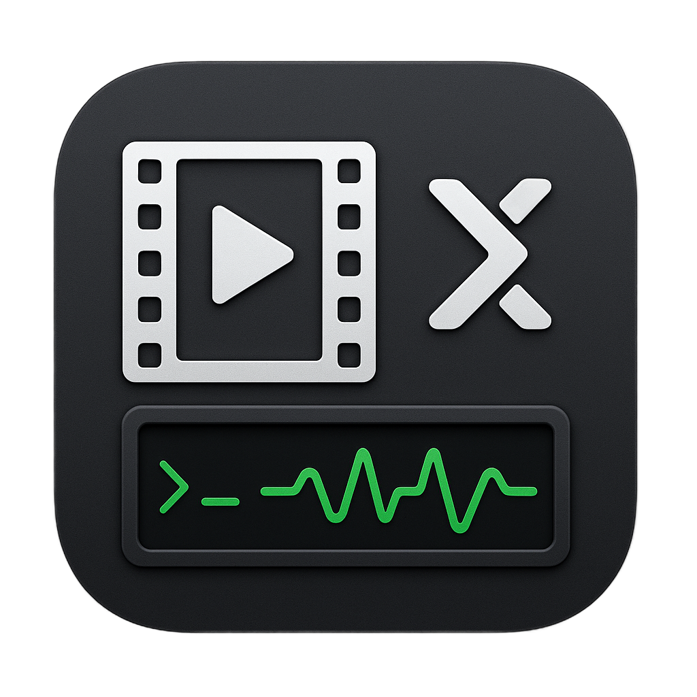

# VidSqueeze



A simple Python-based CLI took for **batch compressing video files** using **FFMPEG**, with optional **Apple-compatible output** and a clean **progress bar interface** via `tqdm`.

This tool is designed for **archiving videos efficiently**, automatically compressing all supported video files in a directory and saving them to an output directory.

## Features

- Batch processes all videos in a directory

- Supports `.mp4`, `.mov`, `.avi`, `.mkv`, `.webm`

- Two compression modes:

  - **High Compression (H.265 / HEVC)** - best for long-term storage

  - **Apple-Compatible (H.264)** - plays natively on macOS

- Real-time progress bar using `tqdm`

- Streams FFMPEG output without blocking

- Automatically deletes original files after successful compression

## Requirements

- Python 3.10+

- FFMPEG (must be installed and available in your PATH)

- Python dependencies:

```bash
pip install tqdm
```

## Install FFMPEG
### macOS (Homebrew)

```bash
brew install ffmpeg
```

### Ubuntu / Debian:

```bash
sudo apt install ffmpeg
```

## Usage

Runt he script from the terminal:

```bash
python main.py
```

You will be prompted for:

1. **Input directory** containing videos

2. **Output directory** (will be created if it doesn't exist and path name is valid)

3. Whether you want **Apple-compatible output**

Example interaction:

```text
Enter input directory path (e.g., ./videos): ./raw_videos
Enter output directory path (e.g., ./videos_converted): ./compressed
Do you want your file(s) to be apple compatible? (y/N): y
```

## Compression Modes

**High Compression (Default)**

- Video codec: `libx265` (H.265 / HEVC)

- Audio: copies without re-encoding

- CRF: 28

- Not natively supported by macOS

Best for **maximum space savings** and **archival storage**

**Apple-Compatible Compression**

- Video codec: `libx264` (H.264)

- Audio: copies without re-encoding

- CRF: 28

- Plays natively on macOS

Best if you need **plug-and-play playback on Apple devices**

## File Handling Behavior

- Only files with supported video extensions are processed

- Output files are always saved as `.mp4`

- If compression succeeds:

  - Original file id **deleted**

- If compression fails:

  - Original file is **left untouched**

## Project Structure

```text
.
├── main.py
└── README.md
```

## Notes & Caveats

- This tool **does not recurse into subdirectories**

- FFMPEG progress output is streamed from `stderr`

- CRF value is fixed at `28` for a balance between size and quality

- No audio re-encoding is performed (`-c:a copy`)

## Future Improvements (Ideas)

- Recursive directory support

- Custom CRF / codec flags via SLI arguments

- Dry-run mode

- Preserve originals option

- Parallel video processing
